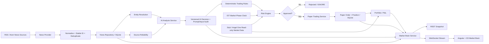
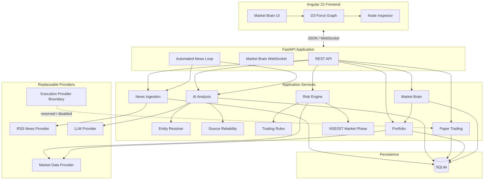

# Profit Pilot AI News

AI-driven Indian market news intelligence and **paper-trading-only** platform. The MVP turns market news into an auditable AI decision, applies deterministic trading and risk controls, optionally creates a paper fill, updates portfolio/P&L, and streams the state to the Market Brain UI.

> **MVP safety boundary:** no live broker order execution is implemented. Angel One is a read-only market-data boundary only. Keep broker credentials empty unless read-only market data is explicitly being configured.

## 1. MVP status

The current implementation on `feature/free-news-sources-v1` contains the complete MVP application flow:

- FastAPI backend with versioned REST APIs and a Market Brain WebSocket.
- SQLite persistence for news events, AI decisions/audit snapshots, paper orders, and positions.
- Free RSS/Atom news ingestion with parallel feed fetching, failure isolation, normalization, stable event IDs, cross-feed deduplication, and configurable item limits/timeouts.
- Deterministic NSE company/entity resolution with canonical names, aliases, symbols, and confidence.
- Source-reliability metadata used as AI context and exposed in Market Brain metadata.
- Versioned AI prompt context with persisted prompt/input snapshots.
- Deterministic trading rules separate from LLM reasoning.
- Risk engine enforcing market phase, quantity, price, notional, and duplicate-event controls.
- Atomic paper execution and position persistence with realized P&L support.
- Portfolio snapshots with current price, unrealized P&L, and total P&L.
- Automated news intelligence loop with configurable polling and trade quantity.
- Incremental automated ingestion so the same RSS item is not repeatedly sent through AI/risk processing on every poll.
- Conservative IST market-phase clock: PRE_MARKET, MARKET_HOURS, POST_MARKET; weekends are POST_MARKET.
- Market Brain graph assembled from persisted state and refreshed through WebSocket broadcasts.
- Angular 22 + D3 frontend foundation with interactive Market Brain nodes and inspector.
- Configurable provider boundaries for news, LLM, market data, and execution.
- Angel One SmartAPI placeholders retained in `.env.example`; execution remains disabled.
- Unit coverage for trading rules, risk, paper trading, portfolio, RSS parsing, entity resolution, source reliability, automated polling, and market-phase boundaries.

CI workflow is intentionally **not part of this release-readiness decision** and has been left untouched as requested.

## 2. System design

### End-to-end architecture



### Runtime component boundaries



### Automated cycle

```mermaid
sequenceDiagram
    participant Timer as Poll Timer
    participant Loop as AutomatedNewsLoop
    participant RSS as News Provider
    participant DB as SQLite
    participant Proc as Event Processing
    participant AI as AI Analysis
    participant Risk as Rules + Risk
    participant Paper as Paper Trading
    participant Brain as Market Brain

    Timer->>Loop: every NEWS_POLL_INTERVAL_SECONDS
    Loop->>RSS: fetch feeds concurrently
    RSS-->>Loop: normalized NewsEvents
    Loop->>DB: check event IDs + persist
    DB-->>Loop: new events only
    Loop->>Proc: process each new event
    Proc->>AI: analyze if no persisted decision
    AI->>DB: persist decision + prompt/input snapshot
    AI-->>Proc: structured BUY/SELL/IGNORE decision
    Proc->>Risk: deterministic rules + phase + market data
    Risk-->>Proc: TradeIntent
    alt Approved BUY/SELL
        Proc->>Paper: execute paper fill
        Paper->>DB: atomic order + position update
    else Rejected / IGNORE
        Proc-->>Loop: no execution
    end
    Loop->>Brain: broadcast refreshed snapshot
```

## 3. News intelligence pipeline

`News Sources → Normalize/Deduplicate → Entity Resolution → Source Reliability → AI Analysis → Deterministic Signal → Risk → Paper Trade → Outcome → Market Brain`

### News ingestion

`RssNewsProvider` supports RSS and Atom feeds, parallel fetching, per-feed failure isolation, request timeouts, item limits, title/date normalization, stable SHA-256 event IDs, cross-feed deduplication, entity-aware symbol resolution, and configurable keyword fallback.

`NewsIngestionService.ingest()` remains available for manual ingestion and returns fetched events. The automated loop uses `ingest_new()`, which persists all fetched events but returns only previously unseen IDs. This prevents an unchanged RSS item from being repeatedly analyzed or reconsidered every polling cycle.

### Entity resolution

The resolver maps company names, aliases, and symbols to canonical NSE entities. A match contains the NSE symbol, canonical company name, matched alias/text, and deterministic confidence. The starter catalog covers a broad set of liquid NSE names and selected large-cap/MNC-listed names and can later be replaced by an exchange security-master feed.

### Source reliability

A deterministic registry supplies source score/tier context to AI analysis. Configured examples include Reuters, Economic Times, Moneycontrol, CNBC-TV18, Business Standard, Mint, BusinessLine, and Google News. Unknown sources receive a neutral fallback score.

Source reliability is **context, not a trading override**. Deterministic rules and risk controls remain the final gate before paper execution.

## 4. AI analysis and auditability

Every analysis produces:

- `signal`: BUY / SELL / IGNORE
- `confidence`: 0–1
- `reasoning`
- `prompt_version`
- `model`

The current development prompt version is `news-impact-v2`.

The AI service persists the prompt text and serialized input snapshot alongside the decision. The default LLM provider is a deterministic stub so development/testing does not require an external LLM account.

## 5. Deterministic trading and risk controls

LLM output is **not** sent directly to execution.

### Trading rules — `trading-rules-v1`

1. A resolvable symbol must exist.
2. AI signal must not be IGNORE.
3. Event materiality must be at least `0.60`.
4. AI confidence must be at least `0.65`.

### Risk engine — `risk-engine-v1`

- Allowed market phases.
- Maximum order quantity (`1,000` by default).
- Valid positive market price.
- Maximum order notional (`100,000` by default).
- Duplicate event protection.

The default allowed execution phase is **MARKET_HOURS** only. PRE_MARKET and POST_MARKET news can still be ingested/analyzed, but the current risk configuration rejects paper trades outside market hours.

### Market phase

| IST time | Phase | Paper execution by default |
|---|---|---|
| Before 09:15 | PRE_MARKET | No |
| 09:15–15:30 | MARKET_HOURS | Yes, subject to all rules |
| 15:30 onward | POST_MARKET | No |
| Saturday/Sunday | POST_MARKET | No |

The MVP does not contain a complete NSE holiday calendar. `current_market_phase()` is deliberately replaceable with a full exchange-calendar implementation later.

## 6. Paper trading and P&L

`PaperTradingService` is the only active execution path. It supports BUY/SELL paper fills, long and short signed positions, same-direction average-price updates, position reduction/reversal, realized P&L, unrealized P&L from market data, atomic order+position persistence, and one paper order per news event.

A duplicate event returns `ALREADY_EXECUTED` rather than creating a second paper order.

## 7. Market Brain

The graph is generated from persisted application state:

`NEWS → AI → STOCK → PAPER_TRADE → POSITION`

Metadata exposes news source/time/materiality/reliability, AI signal/confidence/reasoning/prompt/model, canonical stock/entity match, paper fill details, and position/P&L details. The WebSocket sends the current graph on connection and broadcasts refreshed snapshots after application-state changes.

## 8. REST and WebSocket API

### Health

`GET /health` — application environment, database health, provider configuration, and automated-loop status.

### News

- `POST /api/v1/news/ingest` — manual provider ingestion.
- `GET /api/v1/news` — recent persisted news.
- `POST /api/v1/news/{event_id}/analyze` — AI analysis.
- `GET /api/v1/news/{event_id}/decisions` — persisted AI decisions.
- `POST /api/v1/news/{event_id}/process` — full AI → rules → risk → paper flow.
- `POST /api/v1/news/{event_id}/trade-intent` — create intent without execution.

### Paper trading

- `POST /api/v1/trade-intents/execute` — execute an approved paper intent.
- `GET /api/v1/paper/orders` — paper order history.
- `GET /api/v1/paper/positions` — positions with current P&L.

### Market Brain

- `GET /api/v1/market-brain/snapshot` — current graph snapshot.
- `WS /ws/market-brain` — live graph updates.

## 9. Configuration

Copy `.env.example` to `.env`.

### Minimal stub development

```env
LLM_PROVIDER=stub
MARKET_DATA_PROVIDER=stub
NEWS_PROVIDER=stub
```

### Free RSS trial

```env
NEWS_PROVIDER=rss
NEWS_RSS_FEEDS=https://news.google.com/rss/search?q=NSE+India+stocks&hl=en-IN&gl=IN&ceid=IN:en
NEWS_POLL_INTERVAL_SECONDS=300
NEWS_TRADE_QUANTITY=1
```

Optional symbol mappings:

```env
NEWS_SYMBOL_KEYWORDS_JSON={"RELIANCE":["Reliance Industries","Reliance"],"TCS":["Tata Consultancy Services","TCS"]}
```

Use public feeds/endpoints permitted by their terms and access policies; the RSS provider does not scrape article bodies.

### Risk configuration

```env
MAX_ORDER_NOTIONAL=100000
MAX_ORDER_QUANTITY=1000
```

### Angel One placeholders

```env
ANGEL_API_KEY=
ANGEL_CLIENT_CODE=
ANGEL_PASSWORD=
ANGEL_TOTP_SECRET=
ANGEL_EXCHANGE=NSE
ANGEL_SYMBOL_TOKENS_JSON={}
```

The Angel One market-data adapter is read-only. There is no live order placement implementation in this MVP.

## 10. Local development

### Backend

```bash
python -m venv .venv
source .venv/bin/activate
pip install -e ".[dev]"
uvicorn app.main:app --reload --app-dir backend
```

Windows PowerShell activation:

```powershell
.venv\Scripts\Activate.ps1
```

### Frontend

```bash
cd frontend
npm install
npm start
```

Market Brain WebSocket:

```text
ws://localhost:8000/ws/market-brain
```

### Docker Compose

```bash
docker compose up --build
```

SQLite data is stored according to `DATABASE_URL`. Redis is available in Compose for future caching/pub-sub work; the MVP does not require Redis for correctness.

## 11. Testing and quality gates

Configured quality tooling:

- `pytest` — automated tests.
- `Ruff` — linting.
- `mypy` — type checking.
- Angular build tooling — frontend compilation.

Test coverage includes trading rules, risk limits and phase gating, paper execution and P&L, SQLite atomicity, RSS/Atom parsing and deduplication, entity resolution, source reliability, automated polling, market-phase boundaries, and Market Brain graph construction.

CI workflow validation is intentionally deferred and is not used as the MVP release gate, per project direction.

## 12. Repository structure

```text
backend/
  app/
    config.py
    main.py
    domain/models.py
    providers/
      interfaces.py
      rss_news.py
      stub_news.py
      stub_llm.py
      stub_market_data.py
      angel_one.py
    services/
      ai_analysis.py
      automated_news_loop.py
      entity_catalog.py
      entity_resolution.py
      event_processing.py
      market_brain.py
      market_phase.py
      news_ingestion.py
      paper_trading.py
      portfolio.py
      prompt_builder.py
      risk_engine.py
      source_reliability.py
      trading_rules.py
      trade_intent.py
    storage/
      database.py
      repositories.py
  tests/

frontend/
  src/app/
    ... Angular 22 + D3 Market Brain ...

compose.yaml
Dockerfile
.env.example
pyproject.toml
README.md
```

## 13. Provider replacement strategy

```text
NewsProvider       → RSS today, other news APIs later
LlmProvider        → Stub today, production LLM later
MarketDataProvider → Stub today, Angel One read-only today, other feeds later
ExecutionProvider  → reserved boundary; live execution disabled
```

Provider replacement does not require rewriting trading rules, risk controls, persistence, or the Market Brain.

## 14. Release-readiness checklist

- [x] End-to-end news → AI → rules → risk → paper flow.
- [x] Automated polling with configurable interval and quantity.
- [x] Automated polling processes only newly discovered events.
- [x] Market phase is no longer hard-coded to MARKET_HOURS.
- [x] PRE_MARKET/POST_MARKET paper execution is blocked by default.
- [x] Deterministic quantity/notional/price controls.
- [x] Duplicate paper execution protection.
- [x] Atomic paper order + position persistence.
- [x] AI prompt and input snapshot auditability.
- [x] Entity and source-reliability context.
- [x] Market Brain REST + WebSocket delivery.
- [x] Angel One credentials remain placeholders; live execution disabled.
- [x] Detailed setup/configuration/architecture documentation.
- [x] Focused tests for automated polling and market-phase boundaries.
- [ ] Full NSE holiday calendar — future production hardening.
- [ ] Production NSE/security-master synchronization — future hardening.
- [ ] Production LLM provider — future integration.
- [ ] Production-grade news source contracts/licensing — future integration.
- [ ] Live broker execution — explicitly out of MVP scope.
- [ ] CI workflow repair/validation — intentionally deferred.

## 15. Deliberate MVP boundaries

The MVP favors replaceable boundaries and deterministic controls over premature infrastructure. PostgreSQL, Redis-backed workers, DuckDB/Parquet analytics, a full exchange calendar/security master, production LLM routing, richer news licensing, and live execution can be introduced behind the existing boundaries without changing the core news-to-decision-to-paper-trade contract.

## 16. Core safety principle

**AI proposes; deterministic rules decide; risk controls gate; paper trading executes.**

No LLM response can directly place a live broker order in the current system.
